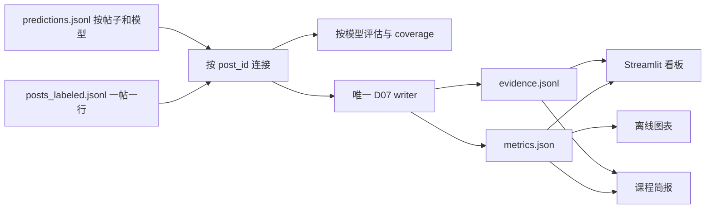

# Main 四轮修复交付讲解

## 概览

这次修复解决了 PR 6 与 PR 7 合并后最关键的三类问题：真实推文正文进入公开 tip、同一帖子因双模型被重复成 3,164 行、Lab 2 与 Lab 3 对同名 D07 产物使用不同结构。最终代码把“帖子”和“模型预测”拆成两个明确的数据层，并让评估、聚合、简报、图表和看板共用版本化契约。

四轮实现已形成四个本地 commit：

1. `af57efa`：清理当前 tip 并冻结数据契约；
2. `adbea16`：重构 Lab 2 预测、评估、缓存和情绪流程；
3. `6ab47ea`：统一 D07 写入入口并接通 Lab 3；
4. `d9842a4`：补充依赖锁、离线流水线、CI、公开聚合指标和文档。

当前本地 `main` 比 `origin/main` 领先四个 commit，尚未推送。

## 产出与修改

### 1. 当前 tip 不再跟踪真实推文正文

- 修改前：
  - `data/analyzed/posts_labeled.jsonl` 提交了 3,164 行真实数据衍生记录；
  - `data/output/evidence.jsonl`、`data/seed/*.jsonl` 也包含真实正文；
  - `.env.example` 被 PR 7 删除。
- 修改后：
  - 上述真实记录级文件已从当前 tip 删除；
  - `data/analyzed/`、`data/output/`、`data/seed/` 默认只保留 `.gitkeep`；
  - 公开仓库只提交无正文的 `data/output/metrics.public.json` 和合成 fixture；
  - `.env.example` 已恢复，且明确记录历史未重写的残余风险。
- 影响：
  - 当前 tip 满足“真实正文只留在本地忽略路径”的公开边界；
  - 旧 commit 仍可能访问到历史正文，本次没有消除该历史风险。
- 相关文件：
  - `.gitignore`
  - `.env.example`
  - `docs/project/DATA_GATE.md`
  - `tests/test_contracts.py`

### 2. 帖子主数据与模型预测彻底分离

- 修改前：
  - 每个模型复制一整条帖子，1,582 个帖子形成 3,164 行；
  - `post_id` 不再唯一；
  - Lab 3 容易把两个模型的行误当成两倍语料。
- 修改后：
  - `posts_labeled.jsonl` 一帖一行，只保存帖子、参考标签和探索性情绪；
  - `predictions.jsonl` 一次模型输出一行，以 `(post_id, model_version)` 为复合唯一键；
  - 成功和失败预测分别通过 `status: ok|error` 表达；
  - 提供 `--from-legacy`，可在不调用 DeepSeek 的情况下迁移旧 3,164 行产物。
- 影响：
  - 语料数量固定为 1,582 个唯一帖子；
  - baseline 与 DeepSeek 可以独立评估，不再重复参考标签分布；
  - 现有 PR 6 预测结果可继续使用，无需 API key。
- 相关文件：
  - `schemas/post.schema.json`
  - `schemas/prediction.schema.json`
  - `src/lab2_analysis/classify.py`
  - `tests/fixtures/sample_predictions.jsonl`

### 3. 评估显式报告覆盖率和失败

- 修改前：
  - DeepSeek 的 150 条失败被排除后，成功子集指标直接与完整 baseline 对比；
  - 下游难以区分“预测错误”和“没有预测”。
- 修改后：
  - 评估先按 `post_id` 连接帖子与预测，再按 `model_version` 分组；
  - `coverage` 显式报告成功覆盖率；
  - `accuracy` 使用完整参考标签分母，失败会降低该指标；
  - `accuracy_on_successful_only`、Macro-F1 和 Weighted-F1 保留为成功预测子集指标；
  - 混淆矩阵按模型独立生成。
- 影响：
  - DeepSeek 的公开聚合结果现在明确为：
    - 1,582 条预测记录；
    - 150 条失败；
    - coverage `0.9052`；
    - 完整分母 accuracy `0.6403`；
    - 成功子集 Macro-F1 `0.5532`。
- 相关文件：
  - `src/lab2_analysis/evaluate.py`
  - `docs/project/evaluation.md`
  - `data/output/metrics.public.json`

### 4. LLM 缓存、断点和置信度更可靠

- 修改前：
  - 失败结果也进入 cache 和 checkpoint，瞬时错误无法在重跑时恢复；
  - cache 只依赖模型名和文本，prompt 或 few-shot 变化后仍可能复用旧结果；
  - JSON fallback 未完整约束置信度。
- 修改后：
  - 仅成功结果进入 cache 和 checkpoint；
  - cache key 加入配置指纹；
  - 置信度必须是有限且位于 `[0,1]` 的数值；
  - 失败结果保持可重试。
- 影响：
  - 中断恢复不再把失败误判为完成；
  - 实验配置变化后不会静默命中旧缓存。
- 相关文件：
  - `src/utils/cache.py`
  - `src/utils/llm.py`
  - `tests/test_lab2.py`

### 5. 情绪标注流程可以精确抽样和严格合并

- 修改前：
  - 请求 20 条时可能只返回 14 条；
  - IAA 可在标注缺失时静默使用交集；
  - 人工情绪结果没有可靠地进入主数据。
- 修改后：
  - 分层抽样在样本池允许时精确返回 `n_total`；
  - 完整性、重复 ID 和标签枚举在计算 IAA、合并前统一验证；
  - IAA 报告由代码生成；
  - 情绪合并只更新唯一帖子记录。
- 影响：
  - 标注规模、IAA 分母和正式数据中的情绪记录可以对账。
- 相关文件：
  - `src/lab2_analysis/annotate_seed.py`
  - `tests/test_lab2.py`

### 6. D07 只有一个正式 schema 和一个真实写入入口

- 修改前：
  - `src/lab2_analysis/aggregate.py` 与 `src/lab3_decision/build_evidence.py` 都写 `metrics.json` 和 `evidence.jsonl`；
  - 两者字段完全不同，导致看板和简报读取已提交产物时崩溃。
- 修改后：
  - `build_evidence.py` 是 D07 的唯一实现；
  - `aggregate.py` 只作为兼容 wrapper 复用同一实现；
  - metrics v2 区分 corpus 级统计和 `per_model` 指标；
  - evidence 记录模型版本和选择理由；
  - HumAID 真实来源的 `text_clean` 必须为 `null`，合成 fixture 才允许正文。
- 影响：
  - Lab 2 和 Lab 3 不再互相覆盖不兼容的输出；
  - 真实聚合指标可公开，记录级演示继续使用 synthetic fixture。
- 相关文件：
  - `schemas/metrics.schema.json`
  - `schemas/evidence.schema.json`
  - `src/lab3_decision/build_evidence.py`
  - `src/lab2_analysis/aggregate.py`
  - `tests/test_contracts.py`
  - `tests/test_lab3.py`

### 7. 看板、简报和图表按同一模型口径工作

- 修改前：
  - 看板从少量 evidence 重建“混淆矩阵”；
  - 紧急需求记录没有真正写入 evidence；
  - 情绪占比错误地除以全部帖子数；
  - 简报包含不随数据变化的硬编码结论。
- 修改后：
  - 看板默认读取 `metrics.public.json`，展示 1,582 条真实记录的无正文聚合指标；
  - 侧栏可显式切换到 synthetic fixture，真实模式不会混入 fixture evidence、情绪或简报；
  - 看板提供模型选择，并读取 metrics 中的全量混淆矩阵；
  - evidence 对紧急需求记录全量纳入；
  - 情绪占比使用实际已标注子集；
  - 简报中的模型、数量、覆盖率、关键类别和情绪结论全部动态生成；
  - 真实来源模式不显示帖子正文。
- 影响：
  - 看板、简报、静态图和 D07 使用同一模型、同一分母和同一 schema。
- 相关文件：
  - `app.py`
  - `config/briefing_template.md.j2`
  - `src/lab3_decision/generate_briefing.py`
  - `src/lab3_decision/figures.py`

### 8. 增加离线流水线、依赖锁和 CI

- 修改前：
  - `run_pipeline.sh` 只检查 schema 和 fixture 行数；
  - 离线模式仍要求本地 raw 数据；
  - `requirements.lock` 含本机 `file://` 路径和冲突版本；
  - 没有 CI。
- 修改后：
  - 离线流水线设计为：fixture posts → 两模型模拟预测 → evaluation → D07 → briefing → figures → dashboard 数据加载；
  - 不需要 raw 数据、API key 或网络；
  - lock 文件改为可移植的固定版本集合；
  - GitHub Actions 配置包含测试、离线 E2E 和 tracked-tree 隐私扫描。
- 影响：
  - clean clone 具有明确的课程发布级验证入口；
  - CI 能阻止重新提交真实记录级数据。
- 相关文件：
  - `run_pipeline.sh`
  - `requirements.lock`
  - `.github/workflows/ci.yml`
  - `docs/project/environment_check.md`

## 工作原理



真实运行中，帖子正文和逐条预测留在本地忽略目录；公开 tip 只保留不含正文的聚合指标。离线演示则用 20 条合成帖子和合成预测完整走通同一套 schema。

## 关键决策

- 帖子与模型预测分表：避免 1,582 个帖子被统计为 3,164 条语料；每个模型可以独立覆盖、失败和评估。
- 复用既有 DeepSeek 结果：课程发布不依赖新的 API key，也没有产生新的 DeepSeek 推理。
- 公开真实聚合、记录级使用合成示例：保留真实实验价值，同时不再发布帖子正文。
- D07 单一写入入口：消除 Lab 2/3 对同一路径的 schema 竞争。
- 只清理当前 tip：没有重写 Git 历史，历史暴露作为接受的残余风险记录。

## 使用方式

### 离线课程流水线

```bash
python3 -m venv .venv
source .venv/bin/activate
pip install -r requirements.lock
bash run_pipeline.sh --fixture --offline
```

该命令已在无 raw 数据、无 API key、无网络访问的条件下完成全部阶段。

### 无 API 迁移旧 DeepSeek 结果

```bash
python -m src.lab2_analysis.classify \
  --from-legacy path/to/legacy_posts_labeled.jsonl

python -m src.lab2_analysis.evaluate
python -m src.lab3_decision.build_evidence
```

迁移后会生成一帖一行的 `posts_labeled.jsonl` 和独立 `predictions.jsonl`。

### 生成课程产物

```bash
python -m src.lab3_decision.generate_briefing
python -m src.lab3_decision.figures
streamlit run app.py
```

## 验证

### 当前可复现结果

- 命令：`.venv/bin/python -m pytest tests/test_contracts.py -q`
- 实际结果：`14 passed`
- 命令：`MPLCONFIGDIR="$PWD/data/cache/matplotlib" bash run_pipeline.sh --fixture --offline`
- 流水线内完整测试结果：`122 passed, 4 skipped`
- 流水线结果：
  - 生成 20 条唯一 synthetic posts 和 24 条双模型预测；
  - 生成逐模型 evaluation，并用实际 `model_version` 动态生成对比表；
  - 生成 D07 metrics 和 24 条 evidence；
  - 生成 briefing 和五类静态图；
  - dashboard 数据加载与 schema 校验通过；
  - Streamlit 回归测试确认默认展示真实 1,582 条公开聚合指标，并可切换到 20 条 fixture。
- 两条 sklearn warning 来自小样本 Cohen's Kappa 的零分母场景，不是本次失败原因。
- 复跑时将 `MPLCONFIGDIR` 指向工作区缓存目录，图表全部生成，命令退出码为 0。

### 尚未成立的验证声明与输出限制

- CI 文件已创建，但四个 commit 尚未推送，GitHub CI 尚未对当前树运行。

## 计划与实际差异

- 四轮计划均有对应代码和独立 commit，数据模型与 D07 统一方向符合计划。
- 第四轮增加 `metrics.public.json` 后，第一轮的隐私测试 allowlist 未同步；本次已将该文件加入精确 allowlist，并增加 schema 与正文缺失校验。
- 计划要求的全部 pytest 与 synthetic offline pipeline 现已通过。
- 仓库中没有 `.claude/notes/*-implementation.md` 执行笔记；本说明的过程依据来自已批准计划、四个 commit、最终代码与实际测试，而非补写过程日志。

## 限制与后续

- Git 历史未重写，旧 commit 中的真实正文仍可能被访问。
- 没有重新调用 DeepSeek；公开指标来自 PR 6 已提交的既有预测，仓库只能证明产物声明的 `model_version`，不能独立证明 API 调用来源。
- DeepSeek 的 Macro-F1 `0.5532` 仍是成功预测子集指标；完整分母通过 coverage `0.9052` 和 accuracy `0.6403` 表达。
- 真实 1,582 条帖子中没有已合并的探索性情绪，因此公开 metrics 的 `records_with_emotion` 为 0。
- `artifacts/figures/` 目前有七个可再生成的未跟踪 PNG，不属于四个 commit。
- 本地 `main` 领先 `origin/main` 四个 commit；本次契约、动态报告、真实结果默认看板及讲解文档修改也尚未提交、推送。

## 参考资料

- 已批准计划：`/Users/evenywcai/.cursor/plans/分轮修复主线_4b48ad16.plan.md`
- 四轮提交：`af57efa`、`adbea16`、`6ab47ea`、`d9842a4`
- 数据边界：`docs/project/DATA_GATE.md`
- 数据契约：`schemas/post.schema.json`、`schemas/prediction.schema.json`、`schemas/metrics.schema.json`、`schemas/evidence.schema.json`
- 合成测试数据：`tests/fixtures/`
- 契约测试：`tests/test_contracts.py`
- Lab 2 测试：`tests/test_lab2.py`
- Lab 3 测试：`tests/test_lab3.py`
- 离线入口：`run_pipeline.sh`
- CI：`.github/workflows/ci.yml`
