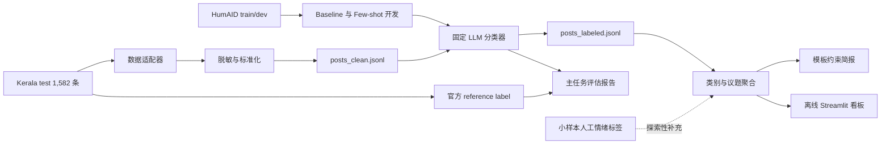

# 课程项目实施方案

> 课程：社会计算与生成决策智能 · 暑期学校  
> 日期：2026-07-13  
> 约束：四天、三人小组、AI 辅助编程（Vibe Coding）  
> 项目题目：Kerala 2018 洪水社交媒体人道信息分类与分析简报
> 项目定位：历史事件复盘型课程技术演示，不构成实时监测、权威发布或行动指令  
> 演示策略：离线优先，冻结输入与模型输出，准备录屏兜底

---

## 一、项目概述与约束条件

### 1.1 任务要求

本项目要求各小组在四天内完成一个可运行的社会计算与生成式决策支持流水线，包含三个核心模块：

| 模块 | 核心任务 | 交付日 |
|------|----------|--------|
| Lab 1 — 数据采集 | 社交媒体数据采集、关键词 taxonomy 设计、数据清洗预处理 | 第一天 |
| Lab 2 — 情感/观点分析 | 文本情感分类、领域标签标注、主题聚合与议题分析 | 第二天 |
| Lab 3 — 生成式决策支持 | 基于 LLM 将分析结果转化为信息产品（简报/看板/问答） | 第三天 |
| 系统集成 | 三模块联调、统一数据格式衔接、汇报 Slides 准备 | 第四天 |

### 1.2 已确认决策与团队约束

- 三人小组，每人负责一个核心模块，共同完成集成与汇报
- 四天时间窗口，每天完成一个阶段
- 唯一主数据为 HumAID `kerala_floods_2018`；官方 `test.json` 的 1,582 条记录作为冻结主语料
- 原生 9 类人道信息标签是正式主任务；情绪分析仅作为小样本探索性补充
- 数据没有逐帖时间和地点；项目不承诺时间趋势、地理热点或地图分析
- 使用一个国内模型 API（Qwen 或 DeepSeek 二选一），不在主链路同时维护多套模型
- 现场不依赖实时模型调用、在线资源或临时下载

### 1.3 设计原则

基于团队"**确保四天稳定完成**"的核心诉求，制定以下原则：

1. **数据先于实现**：课程开始前冻结数据、许可说明、字段映射和 20 条脱敏 fixture；不把数据可用性验证留到 Day 1
2. **单一分析语料**：正式分类、类别聚合和简报只使用 Kerala 官方 test split 的 1,582 条记录；train/dev 仅用于 baseline 训练、Few-shot 示例和 Prompt 调整
3. **收敛优先**：固定"单一地区、单一灾害事件"，不做跨事件泛化、实时监测、时序或空间推断
4. **全 Python 栈**：三个模块通过版本化 JSON Lines schema 衔接，并为下游提供固定 fixture
5. **先跑通再优化**：Day 1 上午先用 20 条 fixture 跑通数据→分析→简报→看板的纵向切片
6. **离线可演示**：API 结果、图表和简报全部缓存；断网时仍能完成核心展示
7. **最小可信边界**：区分数据集记录、人工标注、模型预测和外部权威资料，不使用未经定义的"已核验事实"

---

## 二、应用方向选择与可行性分析

### 2.1 主方向：Kerala 洪水社交媒体人道信息分类课程演示

**一句话定义**：基于 HumAID 中 2018 年 Kerala 洪水事件的冻结、脱敏英文社交媒体文本，比较传统文本分类 baseline 与 LLM Few-shot 分类，识别人道信息类别并生成可追溯的中文课程分析简报。

本项目只验证技术流程和课程概念，不评价真实救援效果，不推断总体公众需求，不对外发布灾情，也不提供救援调度建议。

### 2.2 已冻结数据路线与课前硬门禁

| 数据部分 | 作用 | 当前状态 | 使用边界 |
|----------|------|----------|----------|
| HumAID `kerala_floods_2018/test.json` | 冻结主语料与正式评估集 | 1,582 条，字段为 `tweet_id`、`tweet_text`、`class_label` | 全量进入主流水线；官方标签只作 reference label，不得用于生成模型预测 |
| HumAID `train.json` | baseline 训练与 Few-shot 候选池 | 5,588 条 | 不进入简报统计，不与 test 混合计算类别分布 |
| HumAID `dev.json` | baseline 调参与 Prompt 开发 | 814 条 | 只用于开发；Prompt 冻结后不得根据 test 结果反复修改 |
| 探索性情绪样本 | 满足领域情感分析与课程讨论 | 从 train/test 分别抽取开发样本和锁定样本，人工补充情绪标签 | 与原生 9 类主任务分开报告，不宣称是 HumAID 官方标签 |

课程开始前必须完成 `DATA_GATE.md`，同时满足：

1. 主语料可在演示机器本地读取，文件校验和已记录；
2. 至少包含正文，且能够确定统一事件范围；时间、地点字段可缺失，但缺失情况必须在方案中明确；
3. 许可或论文数据可用性声明已存档，Slides 中给出署名；
4. 原始文本完成隐私抽样审计，手机号、身份证号、姓名、账号和精确住址可被脱敏；
5. 能生成 20 条人工改写或合成 fixture 和统一 schema，fixture 不复制真实帖子正文；
6. 明确 HumAID 官方许可标识与 QCRI 使用条款的差异；采取较严格口径，原始正文、真实文本 fixture、Slides 截图和录屏不得公开再分发；
7. 固定 test split 的 1,582 条记录为唯一主语料，记录 train/dev/test 三份文件的 SHA-256，课程期间不再切换事件或数据源。

### 2.3 数据切分与证据边界

```text
HumAID train ──→ TF-IDF baseline 训练 / Few-shot 示例候选
HumAID dev   ──→ baseline 调参 / Prompt 调整
HumAID test  ──→ 冻结主语料 → 清洗 → 模型预测 → 评估 → 聚合 → 中文课程简报
                     └──── 官方 class_label 只进入评估支路，不进入模型输入
```

官方 `class_label` 表示数据集人工标注的人道信息类别，不表示灾情事实已经核验。Kerala 子集没有逐帖时间、地点或 URL，因此所有相关字段统一为 `null`，不得根据事件背景补造。项目不再引入任何异事件空间数据，以保持单事件叙事一致。

---

## 三、总体技术架构

### 3.1 架构图



三个成员从 Day 1 起使用同一份 `tests/fixtures/sample_posts.jsonl` 并行开发。下游不等待完整上游数据，而以固定 fixture 和机器可执行 schema 作为契约。

### 3.2 统一数据格式（JSON Lines）

三个模块通过版本化 schema 衔接。字段缺失使用 `null`，不得伪造时间、地点或 URL：

```json
{
  "schema_version": "1.0.0",
  "pipeline_run_id": "kerala-2018-test-v1",
  "post_id": "1038812345678901234",
  "text_clean": "Redacted English disaster-related post",
  "event_id": "kerala_floods_2018",
  "time": null,
  "location": null,
  "source": "humaid_events",
  "source_ref": "humaid_events:kerala_floods_2018:test:1038812345678901234",
  "pii_redacted": true,

  "_lab2": {
    "reference_label": "requests_or_urgent_needs",
    "predicted_label": "requests_or_urgent_needs",
    "model_scores": {"requests_or_urgent_needs": 0.92},
    "exploratory_emotion": null,
    "evidence_status": "model_prediction",
    "model_version": "qwen-or-deepseek-pinned-version"
  },

  "_lab3": {
    "briefing_relevance": "high",
    "briefing_summary": "该记录被归为紧急需求类；这只表示数据集中的可见信息，不等于事实核验。",
    "used_in_section": "人道信息类别"
  }
}
```

原始正文只允许保存在不提交仓库的 `data/raw/`。正式接口不设置 `text_raw` 或含义模糊的 `text` 字段，三个 Lab 只能传递已脱敏的 `text_clean`；需要追溯原始记录时使用 `source_ref` 在受控的本地原始数据中定位。

**核心字段级契约**：

| 字段 | 类型 | 产生方 | 必填/可空 | 下游约束 |
|------|------|--------|-----------|----------|
| `schema_version` | string | 全组冻结 | 必填、不可空 | 所有产物必须一致；破坏性变更时升级版本 |
| `pipeline_run_id` | string | 流水线入口 | 必填、不可空 | 同一次运行的三个 Lab 产物必须一致 |
| `post_id` | string | Lab 1 | 必填、不可空 | 由原始 `tweet_id` 无损转为字符串；禁止以 JavaScript number 传递；下游不得改写 |
| `text_clean` | string | Lab 1 | 必填、不可空 | 必须已脱敏；不得用原文覆盖或尝试反向恢复 |
| `event_id` | string | Lab 1 | 必填、不可空 | 固定为 `kerala_floods_2018`；课程期间不得修改 |
| `time` | ISO 8601 string | Lab 1 | 可为 `null` | 仅保留数据中真实存在的时间，不得补造事件日期 |
| `location` | object | Lab 1 | 当前固定为 `null` | HumAID Kerala 文件没有逐帖地点，不得从正文推测并写回正式字段 |
| `source` | string | Lab 1 | 必填、不可空 | 使用冻结的数据源标识，不得笼统写“网络” |
| `source_ref` | string | Lab 1 | 必填、不可空 | 是本地追溯标识而非公开 URL；下游不得改写 |
| `pii_redacted` | boolean | Lab 1 | 必填、不可空 | 只有完成脱敏检查后才能为 `true`；否则禁止交接 |
| `_lab2` | object | Lab 2 | Lab 1 阶段为 `null`，Lab 2 后必填 | 只能追加分析结果，不得修改 Lab 1 字段 |
| `_lab3` | object | Lab 3 | Lab 1/2 阶段为 `null`，最终产物可填 | 只能追加展示元数据，不得覆盖证据状态或模型标签 |

`_lab2.reference_label` 只允许来自官方 test split；`_lab2.predicted_label` 只允许来自固定模型运行。二者必须分字段保存，禁止用 reference label 覆盖预测结果。`exploratory_emotion` 是课程补充实验，可为 `null`，不得与 HumAID 官方标签混称为 gold。

`post.schema.json` 是机器判定的最终依据；本表用于团队阅读。二者冲突时必须暂停交接并修正文档或 Schema，不能由成员自行选择一种解释。

`evidence_status` 仅允许：

- `dataset_record`：仅表示数据集中存在该记录；
- `human_labeled`：课程成员已完成人工标签；
- `model_prediction`：模型输出，未经人工确认；
- `external_reference`：来自独立权威资料。

任何状态都不能自动写成“真实灾情已核验”。模型分数只用于排序，不解释为经过校准的真实概率。

### 3.3 技术选型

| 层次 | 技术 | 选型理由 |
|------|------|----------|
| 编程语言 | Python 3.10+ | 全组统一，生态完整 |
| 数据清洗 | pandas + regex | 处理 JSON、HTML 实体、Unicode、去重和隐私占位符 |
| Schema | Pydantic 或 JSON Schema（二选一） | 入口校验、fixture 契约和错误报告 |
| 分类 baseline | TF-IDF + Logistic Regression | 提供低复杂度、可复现对照，证明 LLM 实验增益或差异 |
| 人道信息分类 | 单一 Qwen 或 DeepSeek API + Few-shot | 原生 9 类单标签；固定结构化 JSON 输出 |
| 标签评估 | scikit-learn | 计算 Macro-F1、各类别 Precision/Recall |
| 简报生成 | Python 聚合 + Jinja2 模板 + 可选 LLM 改写 | 数字与引用由程序生成，LLM 不负责创造事实 |
| 图表 | pandas/matplotlib | 类别分布、混淆矩阵、模型对比和探索性情绪统计完全离线 |
| 看板 | Streamlit | 只读取冻结产物，不在现场触发批量 API 调用 |
| 环境管理 | 锁定 Python 小版本 + requirements lock | 三台机器使用同一依赖快照，记录冷启动命令 |

不引入 LangChain、LlamaIndex、ChromaDB、地图或地理编码链路。少量外部说明文档使用关键词检索或预选摘录即可。RAG 和“附来源”都不等于事实核验。

---

## 四、四天实施计划

### 4.0 课前准备（硬门禁，不占课程 Day 1）

| 任务 | 验收产物 |
|------|----------|
| 完成主语料下载、许可记录、字段核验与隐私抽样 | `docs/project/DATA_GATE.md` |
| 冻结 Kerala 官方 test split 的 1,582 条主语料，并登记 train/dev 仅作开发输入 | `data/frozen/manifest.json`（数据本体不提交公开仓库） |
| 生成 20 条人工改写或合成 fixture，覆盖 9 类、空时间和空地点，不复制真实帖子正文 | `tests/fixtures/sample_posts.jsonl` |
| 固化 schema、模型选择、API Key 管理和依赖版本 | `schemas/post.schema.json`、`.env.example`、锁定依赖文件 |
| 在演示机器完成一次安装、启动和断网检查 | `docs/project/environment_check.md` |

Kerala HumAID 已确认为唯一主线。课程期间不再等待其他语料，不切换事件，不加入异事件空间数据。

### 4.1 Day 1 — Lab 1：数据采集与清洗

**目标**：上午跑通 20 条纵向切片；下午完成冻结语料的清洗、脱敏、schema 校验和质量报告。

**时间线**：

| 时段 | 任务 | 产出 |
|------|------|------|
| 上午（1.5h） | 用 20 条 fixture 跑通 `适配→脱敏→假分类结果→聚合→简报→看板`，冻结接口 | 可运行 `run_pipeline.sh --fixture --offline` |
| 上午（1h） | 固化原生 9 类标签说明；设计洪水领域关键词 taxonomy，用于相关性与覆盖率审计，不声称这些关键词用于原始推文采集 | `config/taxonomy.yaml`、`config/labeling_schema.yaml` |
| 下午（2h） | 完成 JSON 适配、HTML/Unicode 标准化、去重和脱敏；账号、电话、姓名及精确地址替换为统一占位符 | 清洗脚本 + 脱敏审计样本 |
| 下午（1h） | schema 校验与质量报告：split 条数、9 类分布、重复率、字段缺失率、脱敏命中数和关键词覆盖率 | `posts_clean.jsonl`、`data_quality.md` |
| 缓冲（0.5h） | 处理编码、异常行和团队同步问题 | 可重复运行的 Lab 1 |

**分工**：成员 A（Lab 1 负责人）主导，成员 B/C 辅助 taxonomy 设计和质量检查

**风险控制**：不在 Day 1 换题。`tweet_id` 在入口无损转为字符串；`time` 和 `location` 固定为 `null`；不根据事件日期、地区名称或正文地名伪造逐帖时间和坐标。

---

### 4.2 Day 2 — Lab 2：情感与观点分析

**目标**：在官方 test split 上比较可复现的传统 baseline 与 LLM Few-shot 分类器，并完成独立的小样本探索性情绪分析。

**标签体系**：

| 维度 | 标签 | 地位 |
|------|------|------|
| 人道信息类别（单标签） | `caution_and_advice`、`displaced_people_and_evacuations`、`infrastructure_and_utility_damage`、`injured_or_dead_people`、`not_humanitarian`、`other_relevant_information`、`requests_or_urgent_needs`、`rescue_volunteering_or_donation_effort`、`sympathy_and_support` | 正式主任务；使用 HumAID 官方 reference label 评估 |
| 主情绪（单标签） | 恐慌/焦虑、愤怒、悲伤、积极支持、中性/无法判断 | 探索性补充；人工小样本，不声称为官方 HumAID 标签 |

**时间线**：

| 时段 | 任务 | 产出 |
|------|------|------|
| 上午（1h） | 用官方 train 训练 TF-IDF + Logistic Regression，在 dev 上完成一次固定调参 | baseline 配置与可复现结果 |
| 上午（1h） | 从 train/dev 为 9 类选择固定 Few-shot 示例，冻结 Prompt；不得查看 test 预测结果后反复改 Prompt | Prompt v1 + 示例清单 |
| 下午（1.5h） | 对 1,582 条 test 运行固定模型、温度 0 和 JSON schema 分类；每批缓存，失败记录可断点重跑 | `posts_labeled.jsonl`、`cache/` |
| 下午（1h） | 在完整 test 上比较 baseline 与 LLM：Macro/Weighted-F1、逐类 Precision/Recall/Support、混淆矩阵及紧急需求类召回率 | `evaluation.md`、混淆矩阵 |
| 下午（1h） | 两人先重叠标注 20 条情绪样本，再完成小规模开发/锁定样本；报告一致率和探索性结果 | `emotion_dev.jsonl`、`emotion_test.jsonl` |
| 缓冲（0.5h） | 修复 JSON 解析失败、限流和长文本异常 | 可重复运行的 Lab 2 |

**分工**：成员 B（Lab 2 负责人）主导 baseline、LLM 分类和评估，成员 A 辅助探索性情绪标注，成员 C 辅助类别与议题聚合。

**与通用情感分析的差异**：主任务优先回答灾害信息“具有什么人道功能”，而不是只判断正负面；探索性情绪实验用于说明“恐慌”“悲伤”“支持”与“求助”“设施损坏”等信息功能是不同维度。两者分开存储、分开评估、分开汇报。

---

### 4.3 Day 3 — Lab 3：生成式决策支持

**目标**：生成结构化课程分析简报，并完成可离线展示的看板、录屏和冻结演示包。

**时间线**：

| 时段 | 任务 | 产出 |
|------|------|------|
| 上午（1h） | 程序生成统计表、代表性记录 `source_ref` 和证据清单；数值不交给 LLM 自行计算 | `data/output/metrics.json`、`data/output/evidence.jsonl` |
| 上午（1.5h） | 使用 Jinja2 固定简报结构；可用 LLM 仅改写已提供材料，不允许新增数字、地点或来源 | `briefing.md` |
| 下午（1.5h） | 完成 Streamlit：数据质量、标签分布、代表性脱敏文本、简报四个页面 | 完整 `app.py` |
| 下午（1h） | 生成离线静态图：类别分布、模型对比、混淆矩阵和探索性情绪分布 | `artifacts/figures/` |
| 下午（0.5h） | 人工检查简报中 20 条事实性断言：来源覆盖率、数字一致性、无伪造引用 | `briefing_audit.md` |
| 缓冲（0.5h） | 在断网模式启动看板，录制 3–5 分钟演示视频 | `artifacts/demo/demo.mp4` |

**简报结构示例**：

```markdown
# 课程分析简报 — 2018年 Kerala 洪水社交媒体案例
## 一、概述
## 二、数据范围与质量
## 三、人道信息类别与模型评估
## 四、代表性脱敏记录
## 五、可见讨论中的信息缺口
## 六、探索性情绪分析
## 七、评估结果、偏差与使用边界
```

**分工**：成员 C（Lab 3 负责人）主导模板约束简报和看板，成员 A 检查证据清单与脱敏，成员 B 输出评估图表并参与简报审计。

**可信度保障**：
- 每条关键结论附本地 `source_ref` 或外部资料来源，不在 UI 展示原始求助联系方式
- 明确区分：📄 数据集记录 / 👤 人工标签 / 🤖 模型预测 / 🔗 外部资料
- 外部资料按“事件发生时可用”和“事后复盘资料”分开，避免时间穿越
- 简报末尾声明："本简报用于课程技术演示，仅归纳冻结数据中的可见讨论，不代表真实灾情、总体公众需求或权威结论。"

**看板最小验收清单**：

| 页面 | 必须展示 | 验收要求 |
|------|----------|----------|
| 数据范围与质量 | 数据源、事件范围、记录数、缺失率、重复率、脱敏统计 | 与 `manifest.json` 和 `data_quality.md` 一致 |
| 分类与评估 | 9 类分布、baseline/LLM 对比、Macro/Weighted-F1、逐类 Support 和关键类别召回率 | 与 `data/output/metrics.json` 和 `docs/project/evaluation.md` 一致，不把模型分数写成真实概率 |
| 代表性记录 | 脱敏文本、标签、证据状态、`source_ref` | 不出现原始联系方式、姓名、账号或精确住址 |
| 课程分析简报 | 固定结构简报、来源标识、局限性声明 | 所有数字可重算，关键结论可追溯 |
| 探索性情绪 | 小样本标签分布、一致率和代表性差异 | 明确标注样本规模与探索性质，不推广为全体事件结论 |

四个页面均为必选项；地图、时间线、在线搜索、动画、聊天问答和实时 API 调用均不属于完成标准。

---

### 4.4 Day 4 — 系统集成与汇报准备

**目标**：只做回归修复、Slides 打磨和演练；Day 3 结束时系统已经可以交付。

**时间线**：

| 时段 | 任务 | 产出 |
|------|------|------|
| 上午（1.5h） | 从干净环境执行离线流水线和看板回归；核对文件校验和 | 回归记录 |
| 上午（1h） | 修复阻塞性问题，冻结 release；禁止新增功能 | `release/` |
| 下午（1.5h） | 完成 Slides：数据来源、方法、评估、演示、局限性 | `slides.pptx` |
| 下午（1h） | 使用冻结 release 完整演练两次，并验证录屏可播放 | 演示脚本 |
| 缓冲（1h） | 投屏、字体、视频、网络与问答准备 | 最终交付 |

**分工**：成员 A 负责 release 数据与质量核对，成员 B 负责评估图表和讲解，成员 C 负责看板与简报展示；三人共同演练。Day 4 不再并行开发新功能。

**汇报 Slides 建议结构**（对齐任务书要求）：

```
1. 研究领域与问题背景（2-3 页）
   - 2018 年 Kerala 洪水及社交媒体人道信息处理需求
   - 社交媒体在灾害管理中的角色
   - 本项目的课程演示问题与非实时定位

2. 系统整体架构与流水线设计（2-3 页）
   - 架构图 + 数据流
   - 数据门禁、统一 schema 与隐私处理
   - 技术选型与理由

3. Lab 1 实现过程（2-3 页）
   - HumAID 事件选择、字段映射与关键词 Taxonomy
   - 可复现数据获取、清洗与脱敏流程
   - 数据质量报告

4. Lab 2 实现过程（2-3 页）
   - 原生 9 类人道信息标签体系
   - TF-IDF baseline 与 LLM Few-shot 对比
   - 完整官方 test 上的 Macro/Weighted-F1、逐类 Support、关键类别召回率与混淆矩阵
   - 领域特有情感 vs 通用场景对比
   - 类别与代表性议题聚合结果

5. Lab 3 实现过程（2-3 页）
   - 结构化聚合 + 模板约束生成
   - 来源覆盖与简报审计
   - 证据类型和使用边界

6. 系统演示（2-3 页）
   - Streamlit 离线看板演示；录屏作为故障兜底
   - 课程分析简报样例展示

7. 总结与反思（1-2 页）
   - 遇到的问题及解决方案
   - 数据偏差、时间泄漏和隐私局限
   - 未来改进方向
```

### 4.5 交付物编号台账

编号用于每日同步、验收和问题追踪。只有“负责人自检通过、验收人复验通过、正式路径已落盘”后，状态才能从“进行中”改为“完成”。

| 编号 | 正式交付物 | 负责人 | 验收人 | 截止节点 | 核心验收条件 |
|------|------------|--------|--------|----------|--------------|
| **D01** | `docs/project/DATA_GATE.md` | A | B、C | 课前 | HumAID 来源、使用条款、字段、split、文件哈希和隐私抽样齐全 |
| **D02** | `data/frozen/manifest.json`、`schemas/post.schema.json`、`tests/fixtures/sample_posts.jsonl` | A、B | C | Day 1 11:30 | 版本与校验和固定，fixture 离线纵向切片通过 |
| **D03** | `data/processed/posts_clean.jsonl`、`docs/project/data_quality.md` | A | B 主验、C 抽查 | Day 1 17:00 | 唯一 ID、Schema、脱敏和数据质量检查通过 |
| **D04** | `config/labeling_schema.yaml`、Few-shot 示例清单、`data/seed/emotion_dev.jsonl`、`data/seed/emotion_test.jsonl` | B 主导、全员参与 | A、C | Day 2 10:00 | 原生 9 类冻结；官方 test 未参与 Prompt 调整；探索性情绪样本单独标识 |
| **D05** | `data/analyzed/posts_labeled.jsonl`、`data/cache/`、`data/analyzed/classification_errors.jsonl` | B | C 主验、A 抽查 | Day 2 17:00 | 不改写上游字段；成功、失败、跳过数量可对账 |
| **D06** | `docs/project/evaluation.md`、`artifacts/figures/confusion_matrix.png` | B | A、C | Day 2 17:00 | 指标可复现，包含 Macro/Weighted-F1、逐类 Precision/Recall/Support 和关键类别召回率 |
| **D07** | `data/output/metrics.json`、`data/output/evidence.jsonl` | B 聚合、C 整理 | A | Day 3 11:00 | 数字可由 D05 重算，证据可追溯到 `source_ref` |
| **D08** | `data/output/briefing.md`、`docs/project/briefing_audit.md` | C | A、B | Day 3 15:00 | 20 条断言抽查通过，包含证据边界与局限性声明 |
| **D09** | `app.py`、`artifacts/figures/` | C | A、B | Day 3 17:00 | 四个必选页面断网可用，图表与冻结指标一致，不加载在线地图或 API |
| **D10** | `run_pipeline.sh`、`requirements.lock`、`artifacts/runs/` | 全员，B 维护 Schema 检查 | 三人共同 | Day 3 17:00 | 干净环境下 `--fixture --offline` 退出码为 `0` |
| **D11** | `release/`、`artifacts/demo/demo.mp4` | C 组装，A/B 提供产物 | 三人共同 | Day 4 上午 | 包含启动说明、版本、校验和、已知限制和录屏兜底 |
| **D12** | `README.md`、`slides/项目汇报.pptx`、演示脚本 | 全员 | 三人交叉复核 | Day 4 下午 | 内容与冻结 release 一致，完成两次全流程演练 |

项目开始时在此表基础上建立 `docs/project/handoff_log.md`，逐项记录状态、交付时间、产物校验和、验收结论和未解决问题；不在本文静态方案中频繁修改状态。

---

## 五、目录结构

```
project/
├── README.md                       # 项目说明与快速启动
├── requirements.txt                # Python 依赖
├── requirements.lock               # 冻结依赖版本
├── run_pipeline.sh                 # 一键流水线脚本（Lab 1→2→3）
├── app.py                          # Streamlit 看板入口
├── .env.example                    # API 配置模板，不含真实密钥
│
├── config/
│   ├── taxonomy.yaml               # 关键词 Taxonomy（天气、地名、事件、情感）
│   ├── labeling_schema.yaml        # Lab 2 标签体系定义
│   └── briefing_template.md.j2     # Lab 3 固定简报模板
├── schemas/
│   └── post.schema.json            # 模块间机器可执行数据契约
│
├── src/
│   ├── lab1_collection/
│   │   ├── fetch_data.py           # 数据下载与加载
│   │   ├── clean.py                # 去重、过滤、匿名化
│   │   ├── standardize.py          # 地名标准化、格式统一
│   │   └── __init__.py
│   │
│   ├── lab2_analysis/
│   │   ├── annotate_seed.py        # 种子数据人工标注辅助
│   │   ├── classify.py             # 单一模型 Few-shot 结构化分类
│   │   ├── evaluate.py             # 官方 test split 评估与模型对比
│   │   ├── aggregate.py            # 类别、模型结果与代表性议题聚合
│   │   └── __init__.py
│   │
│   ├── lab3_decision/
│   │   ├── build_evidence.py       # 结构化指标与证据清单
│   │   ├── generate_briefing.py    # 简报生成管线
│   │   └── __init__.py
│   │
│   └── utils/
│       ├── io.py                   # JSONL 读写
│       ├── llm.py                  # LLM API 调用封装（DeepSeek/Qwen）
│       ├── cache.py                # 批次缓存与断点续跑
│       ├── redact.py               # 敏感信息脱敏
│       └── __init__.py
│
├── data/
│   ├── raw/                        # 原始公开数据集（不提交 git）
│   ├── frozen/
│   │   └── manifest.json           # 文件校验和、来源、许可、记录数
│   ├── processed/
│   │   └── posts_clean.jsonl       # Lab 1 输出
│   ├── analyzed/
│   │   ├── posts_labeled.jsonl     # Lab 2 输出
│   │   └── classification_errors.jsonl # 解析/API/Schema 失败记录
│   ├── cache/                      # 模型结构化输出缓存与断点续跑状态
│   ├── output/
│   │   ├── metrics.json            # 可重算的结构化统计
│   │   ├── evidence.jsonl          # 简报证据与 source_ref 清单
│   │   └── briefing.md             # Lab 3 输出（最终简报）
│   ├── seed/
│   │   ├── few_shot_examples.jsonl # 从官方 train/dev 选出的固定示例
│   │   ├── emotion_dev.jsonl       # 探索性情绪 Prompt 调整样本
│   │   └── emotion_test.jsonl      # 探索性情绪锁定样本
│   └── reference/                  # 外部资料，注明事中/事后时间属性
│       └── source_manifest.md
│
├── tests/
│   ├── fixtures/sample_posts.jsonl # 20 条脱敏契约样例
│   └── test_schema.py
│
├── artifacts/
│   ├── figures/                    # 离线静态图
│   ├── demo/demo.mp4               # 录屏兜底
│   └── runs/
│       └── <pipeline_run_id>/run_manifest.json # 运行版本、计数、校验和与错误摘要
│
├── release/                        # 已签收的冻结演示包
│
├── slides/
│   └── 项目汇报.pptx               # 第四天 Slides
│
└── docs/
    ├── course/                     # 原始课程任务书及可阅读 Markdown
    ├── research/                   # 选题调研与候选方向综述
    └── project/
        ├── 实施方案.md              # 本文档
        ├── DATA_GATE.md            # 课前数据门禁记录
        ├── environment_check.md    # 演示机器安装、启动与断网检查
        ├── data_quality.md         # Lab 1 数据质量
        ├── evaluation.md           # Lab 2 评估
        ├── briefing_audit.md       # Lab 3 简报审计
        └── handoff_log.md          # D01–D12 交付、签收与问题记录
```

---

## 六、团队分工与接口契约

| 成员 | 主负责 | 辅助任务 |
|------|--------|----------|
| **成员 A** | Lab 1、数据版本和隐私脱敏 | Day 2 参与探索性情绪标注；Day 3 检查证据引用 |
| **成员 B** | Lab 2、标签指南和评估 | Day 1 维护 schema/fixture；Day 3 输出评估图表 |
| **成员 C** | Lab 3、看板和离线演示包 | Day 1 基于 fixture 搭看板；Day 2 接入聚合数据 |

三人从 Day 1 起并行：A 产生真实数据，B/C 同时用 fixture 开发。每日结束前合并一次，运行 `--fixture --offline` 回归。全员共同复核 9 类标签边界、参与探索性情绪样本、Slides 和演练。

### 6.1 共同工作基线

三名成员以本文档、`schemas/post.schema.json`、`tests/fixtures/sample_posts.jsonl` 和 `data/frozen/manifest.json` 为唯一共同基线。聊天记录、个人脚本输出和未合并分支不能替代正式接口。

- 全组只使用一个冻结的 `schema_version`；本项目初始版本为 `1.0.0`。
- 每次正式流水线运行生成唯一 `pipeline_run_id`，Lab 1、Lab 2 和 Lab 3 的产物必须保持一致。
- JSONL 文件一行一条记录，编码为 UTF-8；禁止使用数组包裹整个文件。
- 所有正式输入输出都必须位于第五章约定路径，不得以个人目录、聊天附件或临时文件作为下游输入。
- 字段缺失时写 `null`；不得用空字符串、`未知`、默认地点或推测时间冒充已知值。
- 下游可以忽略自己不使用的新增可选字段，但不得自行改名、改变类型或重新解释已有字段。
- 原始数据和 API 密钥不得提交仓库；可提交的 fixture、日志、图表、简报和录屏必须先完成脱敏检查。

### 6.2 模块输入输出契约

| 模块 | 唯一正式输入 | 唯一正式输出 | 必须满足的接口条件 | 负责人 | 验收人 |
|------|--------------|--------------|--------------------|--------|--------|
| **Lab 1 数据处理** | `data/raw/`、`data/frozen/manifest.json` | `data/processed/posts_clean.jsonl`、`docs/project/data_quality.md` | 通过 `post.schema.json`；`post_id` 唯一；`_lab2`、`_lab3` 可为 `null`；所有可展示文本已脱敏；记录数和校验和写入 manifest | A | B 主验，C 抽查展示字段 |
| **Lab 2 分类评估** | `posts_clean.jsonl`、`labeling_schema.yaml`、官方 reference label、Few-shot 与探索性情绪样本 | `data/analyzed/posts_labeled.jsonl`、`docs/project/evaluation.md`、模型缓存 | 不得改变 Lab 1 字段；reference/prediction 分开保存；官方 test 不得用于 Prompt 调整；失败记录单独落盘 | B | C 主验，A 抽查来源可追溯性 |
| **Lab 3 简报看板** | `posts_labeled.jsonl`、`briefing_template.md.j2`、独立参考资料 | `data/output/briefing.md`、`app.py`、`artifacts/figures/`、`docs/project/briefing_audit.md` | 不修改上游数据；所有数字可由输入重算；引用可回溯到 `source_ref`；断网可展示；外部参考层不得与帖子做行级关联 | C | A、B 共同验收 |
| **最终发布** | 三个 Lab 的已验收产物 | `release/`、Slides、`demo.mp4` | 固定依赖下离线流水线通过；版本、校验和、已知限制和启动命令齐全 | C 组装，A/B 提供各自产物 | 三人共同签收 |

交接遵循“**生产者自检 → 接收人复验 → 下游读取成功**”三步。生产者完成代码但下游不能读取，不算交接完成；验收人发现接口问题时，由产生不合规产物的上游成员优先修复，不要求下游用临时代码绕过契约。

### 6.3 交接时间与完成定义

| 截止节点 | 交接内容 | 完成判定 |
|----------|----------|----------|
| **Day 1 11:30** | Schema、标签名称、20 条 fixture | 三人基于同一 fixture 启动各自模块；Schema 冻结为 `1.0.0` |
| **Day 1 17:00** | A → B/C：清洗数据与质量报告 | Schema 校验通过；B 能读取并产生假分类结果；C 能显示基础字段 |
| **Day 2 10:00** | 原生 9 类、Prompt、Few-shot 与探索性情绪样本 | Prompt 与示例清单冻结；官方 test 不参与 Prompt 调整 |
| **Day 2 17:00** | B → C/A：分类结果与评估报告 | C 能生成聚合数据；A 能通过 `source_ref` 抽查原始来源 |
| **Day 3 17:00** | C → 全组：简报、看板、静态图和录屏 | 断网演示通过；抽查数字、引用、脱敏和局限性声明 |
| **Day 4 上午** | Release 冻结 | 只允许修复阻塞性缺陷，不得新增字段、标签、数据源或展示功能 |

### 6.4 统一校验与回归

正式交接前，负责人必须在项目根目录运行以下统一入口；脚本退出码为 `0` 才能交接：

```bash
python -m pytest tests/test_schema.py
bash run_pipeline.sh --fixture --offline
```

`run_pipeline.sh` 应依次完成 Schema 校验、Lab 1→2→3 的 fixture 流水线、简报生成和看板输入检查。每次合并前至少保留以下检查结果：

- 输入文件路径、记录数、SHA-256 校验和；
- `schema_version` 和 `pipeline_run_id`；
- 成功、失败、跳过记录数，三者之和必须等于输入记录数；
- 失败记录及原因，不得只在终端打印后丢失；
- 执行时间和依赖版本。

测试或回归失败时，不得把不合规产物标记为“可用”，也不得继续覆盖上一份已通过验收的冻结产物。

### 6.5 冻结与变更控制

接口变更分为两类：

- **兼容变更**：新增可选字段、补充文档、修正不改变语义的实现。负责人通知上下游并补充 fixture 和测试后可合并。
- **破坏性变更**：删除或重命名字段、改变字段类型或标签语义、切换主数据源、改变输出路径。必须由提出者写明原因、影响模块、迁移办法和回滚办法，并取得所有受影响模块负责人的明确同意。

破坏性变更获批后必须同时更新：

1. `post.schema.json` 和 `schema_version`（至少提升次版本或主版本）；
2. `sample_posts.jsonl` 与 `test_schema.py`；
3. 生产者和所有消费者代码；
4. 本文档中的字段、路径或标签说明；
5. 一次完整的 `--fixture --offline` 回归记录。

Day 3 功能冻结后，除修复数据泄露、流水线中断、错误结论或无法演示等阻塞性问题外，不再接受破坏性变更。

### 6.6 协作、签收与阻塞升级

- 每天开始时确认当日输入版本和交付节点；每天结束前由三人共同运行一次离线回归。
- 每个交接项至少包含：产物路径、版本、校验和、自检结果、已知问题、负责人和验收人。
- 验收人应在收到产物后的下一个工作时段内给出“通过”或带复现步骤的“不通过”，不能只回复“收到”。
- 阻塞超过 30 分钟先在组内同步；超过 1 小时仍无法解决，立即启用本文风险矩阵中的降级路线，不把关键阻塞留到当日结束。
- 任何人发现隐私泄露、数据来源不明、测试集泄漏或简报事实不可追溯时，有权暂停发布；修复并重新验收后才能恢复。
- 三人对最终 release 共同负责：A 签收数据与隐私，B 签收标签与评估，C 签收简报与离线演示。

---

## 七、风险矩阵与缓解措施

| 风险 | 概率 | 影响 | 缓解措施 |
|------|------|------|----------|
| HumAID 页面许可标识与 QCRI 使用条款口径不同 | 中 | 高 | `DATA_GATE.md` 存档两者；按较严格条款执行；原始正文不进入公开产物；必要时向维护方确认 |
| 官方 test 被用于 Prompt 调整造成评估泄漏 | 中 | 高 | Few-shot 只从 train/dev 选择；Prompt 冻结后一次性运行 test；保留运行记录 |
| 类别严重不均衡、稀有类指标不稳定 | 高 | 中 | 同时报 Macro/Weighted-F1、逐类 Precision/Recall/Support；不只报告 Accuracy |
| 求助文本泄露个人信息 | 高 | 高 | 课前隐私抽样；屏蔽电话、姓名、账号、身份证和精确住址；UI 只展示脱敏文本 |
| LLM API 限流或返回非 JSON | 中 | 中 | 主样本固定 1,582 条；分批缓存、指数退避、断点续跑；解析失败进入错误文件 |
| 模型结果无法证明合理 | 中 | 高 | 使用完整官方 test reference label，并与 TF-IDF baseline 对比 |
| 简报出现幻觉或伪造引用 | 中 | 高 | 数字和 source_ref 由程序生成；LLM 只改写；人工检查 20 条断言 |
| 社交媒体热点被解释成总体需求 | 中 | 高 | 所有标题使用“数据中可见讨论”；局限性页说明平台与样本偏差 |
| 缺少逐帖时间和地点却被误作时空结论 | 低 | 高 | schema 固定 `time/location=null`；验收清单明确禁止地图与时间趋势 |
| 团队输入版本漂移 | 中 | 中 | `manifest.json` 记录校验和；所有成员使用同一冻结副本 |
| 联调时数据格式不一致 | 低 | 高 | JSON Schema + fixture + 每日离线回归 |
| 现场断网或 API 不可用 | 中 | 高 | 看板读取冻结产物；必选图表为本地静态文件；准备演示录屏 |
| 新功能挤占演练时间 | 中 | 中 | Day 3 冻结功能，Day 4 只修阻塞问题 |

---

## 八、评分对齐检查

对照任务书第九章的四个评分维度，确认方案覆盖情况：

| 评分维度 | 覆盖情况 |
|----------|----------|
| 选题是否明确且具有应用价值 | ✅ Kerala 单一洪水事件的人道信息分类与简报，定位为历史复盘型课程演示 |
| 系统流程是否完整，各模块是否融合领域特征，是否有效集成 | ✅ 三个 Lab 统一 JSONL 衔接；事件选择、洪水关键词、原生人道标签、探索性情绪和简报结构形成完整链路 |
| 实验结果是否合理，并能够体现项目目标 | ✅ 完整官方 test、baseline/LLM 对比、逐类指标与 Support、简报来源覆盖和人工审计 |
| 汇报内容是否清晰、逻辑是否完整、演示效果是否良好 | ✅ Streamlit 离线演示 + 录屏兜底 + 结构化 Slides |

---

## 九、附录：关键参考资源

| 资源 | 用途 | 链接 |
|------|------|------|
| HumAID events | Kerala 单事件 train/dev/test 与官方 reference label | [Hugging Face](https://huggingface.co/datasets/QCRI/HumAID-events) |
| HumAID 官方说明 | 事件范围、标签定义、数据规模与论文引用 | [CrisisNLP](https://crisisnlp.qcri.org/humaid_dataset.html) |
| QCRI 使用条款 | 数据保密、研究用途、删除与引用边界 | [Terms of Use](https://crisisnlp.qcri.org/terms-of-use.html) |
| HumAID 论文 | 数据集方法与 benchmark 背景 | [ICWSM 2021](https://ojs.aaai.org/index.php/ICWSM/article/view/18116) |

---

## 十、验收清单（Definition of Done）

- [ ] `DATA_GATE.md` 明确主语料来源、许可、字段、记录数、校验和与隐私处理
- [ ] `run_pipeline.sh --fixture --offline` 在干净环境成功
- [ ] 主流程严格使用 Kerala 官方 test 的 1,582 条；train/dev 只用于训练、Few-shot 和 Prompt 开发
- [ ] 所有模块通过同一 schema，空时间/地点不被伪造
- [ ] 所有正式产物的 `schema_version`、`pipeline_run_id`、记录数和校验和一致
- [ ] Lab 1→2、Lab 2→3 和最终 release 均完成生产者自检与指定接收人复验
- [ ] 每次交接的失败记录均单独保存，成功、失败、跳过数可与输入总数对账
- [ ] 官方 reference label 与模型 prediction 分字段保存，test 未参与 Prompt 调整
- [ ] 报告 baseline/LLM 的 Macro/Weighted-F1、逐类 Precision/Recall/Support 和紧急需求类召回率
- [ ] 探索性情绪样本与官方 9 类主任务分开存储、分开报告，并记录重叠标注一致率
- [ ] 简报数字与 `source_ref` 由程序产生，20 条断言人工检查通过
- [ ] 原始联系方式、姓名、账号和精确住址不出现在仓库、看板、Slides 或录屏
- [ ] 公开仓库、看板、Slides 和录屏不包含可搜索的原始帖子正文；fixture 为人工改写或合成文本
- [ ] 项目不生成地图、时间趋势或逐帖时空结论
- [ ] 断网时看板、静态图、简报和录屏均可使用
- [ ] Day 3 结束前形成可交付 release，Day 4 不新增功能
- [ ] 三人分别签收数据隐私、模型评估、简报演示，并共同通过最终离线回归

---

## 十一、需求确认单

### 已显性化的决策

- Kerala 2018 HumAID 成为唯一主线，不再等待中文郑州语料 ← 来源：用户确认三个默认选择
- 原生 9 类人道信息分类是正式主任务，情绪仅作探索性补充 ← 来源：用户确认三个默认选择
- 官方 test split 的 1,582 条记录是冻结主语料，train/dev 只作开发输入 ← 来源：用户确认三个默认选择
- 产品定位为纯课程技术演示，不声称真实应急监测 ← 来源：用户选择 2C
- 离线演示优先，缓存模型结果并准备录屏 ← 来源：用户选择 3A

### 选定方向

采用“Kerala 单事件冻结 test 语料 + 可复现数据适配器 + baseline/LLM 分类对比 + 模板约束简报”。不加入异事件空间数据，不制造时间或地点字段。

### 验收标准

以第十章 Definition of Done 为准。优先级依次为：数据与许可门禁、20 条纵向切片、官方 test 评估、离线演示、探索性情绪和视觉增强。

### 遗留开放项

- Qwen 或 DeepSeek 尚未最终锁定；默认选择团队已经拥有稳定额度和结构化输出能力的一个 API
- HumAID 的 Hugging Face 许可标识与 QCRI 使用条款需要在 `DATA_GATE.md` 并列存档；在澄清前按较严格的正文保密边界执行
- 探索性情绪样本的最终规模尚未锁定；默认以不影响完整 9 类主任务为前提控制在 100 条左右
- 团队设备和课程每日实际可用时长未知；默认按每天 6 小时并保留 0.5–1 小时缓冲
